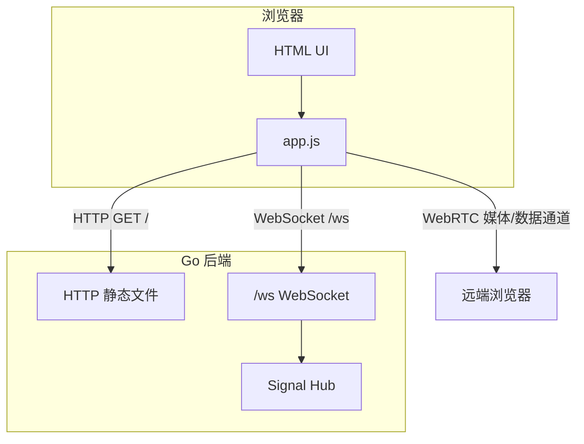

# WebRTC

WebRTC 是一个基于 Go 的最小可用 WebRTC 示例项目，提供 WebSocket 信令服务器与浏览器端 Demo，适合作为实时音视频应用的入门模板。

## 特性

- 🌐 WebSocket 信令服务：使用 Gorilla WebSocket 实现房间内的 Offer/Answer/ICE Candidate 转发。
- 🎥 浏览器前端 Demo：一键采集音视频并发起点对点呼叫。
- ⚙️ Go Modules 管理依赖，便于扩展与部署。
- 🔄 可扩展架构：可进一步接入 TURN/SFU/录制等能力。

## 架构总览



## 快速开始

### 前置要求

- Windows 10/11
- Go 1.22+ （推荐使用 `winget install -e --id GoLang.Go` 安装）
- 浏览器：Chrome / Edge / Firefox 最新版

### 克隆项目

```powershell
git clone https://github.com/<your-org>/WebRTC.git
cd WebRTC
```

### 配置代理（可选，建议国内开发者设置）
```powershell
go env -w GOPROXY=https://goproxy.cn,direct
go env -w GOSUMDB=sum.golang.google.cn
```

### 拉取依赖

```powershell
go mod tidy
```

### 启动服务

```powershell
go run ./cmd/server
```

服务默认监听 `http://localhost:8080`。

### 本地测试

1. 浏览器访问 http://localhost:8080
2. 在两个页面输入相同的房间名并 Join。
3. 复制其中一个页面的 `Your ID` 到另一个页面的 Remote ID，点击 `Call`。
4. 允许浏览器访问摄像头/麦克风，即可看到远端视频。

> 提示：若在同一台机器打开两个窗口但无法互通，请先关闭 `HTTPS-Only` 模式或在隐身窗口测试。

## 文档

- [docs/README.md](docs/README.md)：项目整体技术说明（架构、前端、媒体、录制等）。
- [docs/signaling.md](docs/signaling.md)：信令与房间管理的深入讲解。

## 项目结构

```
WebRTC/
├── cmd/
│   └── server/        # HTTP + WebSocket 服务入口
├── internal/
│   └── signal/        # 信令逻辑（房间管理、消息转发）
├── web/
│   ├── index.html     # 浏览器端 UI
│   └── app.js         # WebRTC & WS 信令逻辑
├── docs/
│   ├── README.md      # 项目技术说明（学习向）
│   └── signaling.md   # 信令与房间管理详解
├── go.mod
├── .gitignore
├── .gitattributes
└── README.md
```

## 路线图

- [ ] 房间成员列表与自动呼叫提示
- [ ] TURN 支持（coturn）
- [ ] 多人通话（Mesh / 引入 SFU 框架）
- [ ] 录制与旁路推流（RTMP/RTC）
- [ ] Docker 镜像与云端部署示例

欢迎提交 Issue 与 PR 参与共建。

## License

[MIT](LICENSE)
