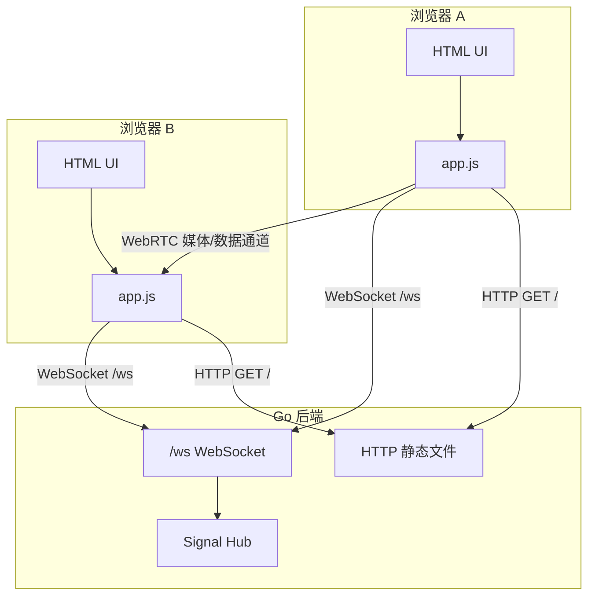
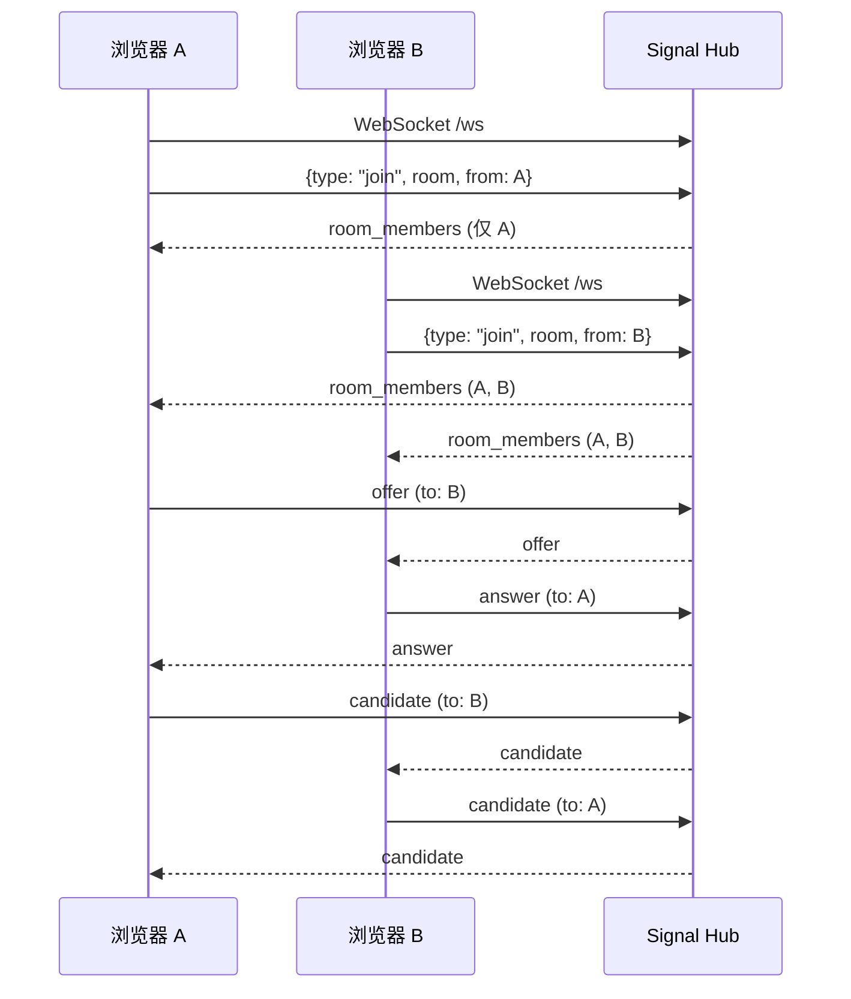
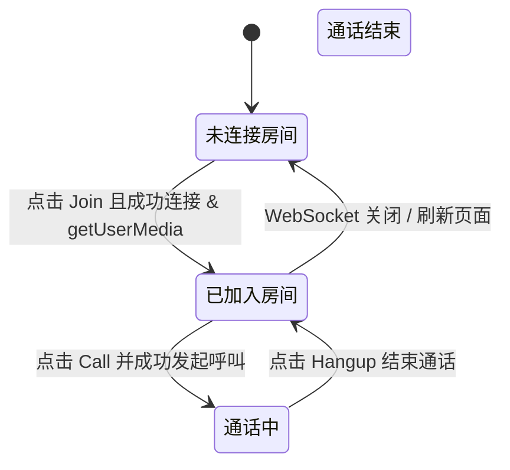

# WebRTC 项目技术说明（学习版）

本目录用于记录 WebRTC 示例项目的**学习向文档**，帮助你从整体把握项目架构、信令流程和前端实现。

> 项目定位：本仓库是一个基于 Go 的最小可用 WebRTC Demo，用于学习一对一通话、信令、媒体控制、DataChannel、录制和简单房间成员管理。

---

## 1. 项目整体架构

### 1.1 模块结构

```text
WebRTC/
├── cmd/
│   └── server/          # HTTP + WebSocket 服务入口
├── internal/
│   └── signal/          # 信令逻辑（房间管理、消息转发）
├── web/                 # 浏览器前端 Demo（纯 HTML + JS）
│   ├── index.html
│   └── app.js
├── docs/                # 文档（当前目录）
├── go.mod
└── README.md
```

- **后端（Go）**
  - 使用 `net/http` 提供静态文件服务（`web/`）。
  - 使用 Gorilla WebSocket 提供 `/ws` 信令通道。
  - `internal/signal` 中实现房间管理、消息转发、房间成员列表广播等。

- **前端（浏览器）**
  - `index.html`：简单 UI（房间、ID、按钮、本地/远端视频、聊天、录制等）。
  - `app.js`：
    - WebSocket 信令处理；
    - WebRTC 媒体流与 `RTCPeerConnection`；
    - 静音/摄像头/屏幕共享控制；
    - DataChannel 文本聊天；
    - 本地录制与下载；
    - 房间成员列表展示。

### 1.2 高层交互示意



---

## 2. 信令服务器与房间管理

### 2.1 `Message` 结构

文件：`internal/signal/message.go`

```go
type Message struct {
    Type      string          `json:"type"`
    Room      string          `json:"room"`
    From      string          `json:"from"`
    To        string          `json:"to,omitempty"`
    SDP       json.RawMessage `json:"sdp,omitempty"`
    Candidate json.RawMessage `json:"candidate,omitempty"`
    Members   []string        `json:"members,omitempty"`
}
```

- `join` / `leave`：房间加入、离开事件。
- `offer` / `answer`：SDP 信息，建立 WebRTC 连接用。
- `candidate`：ICE 候选，帮助打洞。
- `room_members`：服务器广播的“当前房间成员列表”。

可选的辅助消息：

- `ping` / `pong`：简单心跳（前端定时发送 `ping`，服务端可选回 `pong`），用于学习“保活”概念。

### 2.2 Hub 与 Client

文件：`internal/signal/hub.go`

- `Hub`：
  - `rooms map[string]map[string]*Client`：`房间名 -> (客户端 ID -> Client)`。
  - `upg websocket.Upgrader`：升级 HTTP 为 WebSocket。
  - `allowedOrigins` / `allowAllOrigins`：WebSocket `Origin` 校验配置（由服务入口解析 `WS_ALLOWED_ORIGINS` 并通过 `signal.Options` 注入）。

- `Client`：
  - `id`：客户端 ID（由前端生成，例如随机字符串）。
  - `room`：所在房间名。
  - `conn`：WebSocket 连接。
  - `send chan Message`：要发送给该客户端的消息队列。

### 2.3 一对一通话信令时序



### 2.4 房间成员列表广播逻辑

- **加入房间 `addClient`**
  1. 将 `Client` 放入 `rooms[room][id]`；
  2. 枚举该房间所有 `id` 生成 `members []string`；
  3. 构造 `Message{Type: "room_members", Room: room, Members: members}`；
  4. 向房间内所有 `Client.send` 非阻塞写入该消息。

- **离开房间 `removeClient`**
  1. 从 `rooms[room]` 删除该 `id`；
  2. 若房间成员变为 0：删除整个房间；
  3. 若房间还有其他成员：再次生成 `members []string` 并广播 `room_members`，让前端更新列表。

---

## 3. 前端整体流程与状态机

文件：`web/app.js`

### 3.1 核心状态变量

- `state`：`'idle' | 'joined' | 'calling' | 'ended'`。
- `roomId`：当前加入的房间名。
- `myId`：本端随机生成 ID（在页面显示 `Your ID`）。
- `peers`：`peerId -> { pc, dc, remoteStream }` 的映射表，用于 Mesh 多人通话管理多条连接。
- `localStream`：本地媒体流（摄像头 + 麦克风）。
- `screenStream` / `usingScreen`：屏幕共享状态（共享时会对所有 peer 执行 `replaceTrack`）。

### 3.2 状态机



- 不同状态下按钮可用性：
  - `Idle`：只允许 `Join`；
  - `Joined`：允许 `Call`，`Hangup` 禁用；
  - `Calling`：允许继续 `Call`（可对多个成员重复），允许 `Hangup`（结束所有连接但仍留在房间）；
  - `Ended`：可视为回到 `Joined` 或 `Idle`，本项目中挂断后回到 `Joined`（仍在房间）。

---

## 4. 媒体获取与控制

### 4.1 获取本地媒体 `getMedia()`

```js
localStream = await navigator.mediaDevices.getUserMedia({ audio: true, video: true })
document.getElementById('local').srcObject = localStream
```

- 成功时将 `localStream` 绑定到本地 `<video>` 标签；
- 失败时在页面错误区域显示提示（例如权限拒绝）。

### 4.2 将媒体添加到 `RTCPeerConnection`

在 `ensurePC` 中：

```js
await getMedia()
localStream.getTracks().forEach(t => pc.addTrack(t, localStream))
```

- 多人场景下，每个 `peerId` 都会有独立的 `pc`；当收到远端媒体时，动态创建/找到对应的 `<video>` 并绑定：

```js
pc.ontrack = (e) => {
  const video = ensureRemoteTile(peerId)
  if (video) video.srcObject = e.streams[0]
}
```

### 4.3 静音 / 恢复麦克风

```js
const tracks = localStream.getAudioTracks()
muted = !muted
tracks.forEach(t => { t.enabled = !muted })
```

- 通过修改 `MediaStreamTrack.enabled` 控制是否发送音频；
- 按钮文字在 `Mute` 与 `Unmute` 间切换。

### 4.4 摄像头开关

```js
const tracks = localStream.getVideoTracks()
cameraOff = !cameraOff
tracks.forEach(t => { t.enabled = !cameraOff })
```

- 同样使用 `track.enabled`，控制是否发送视频画面。

### 4.5 屏幕共享与 `replaceTrack`

1. 调用 `getDisplayMedia` 获取屏幕流：

   ```js
   const stream = await navigator.mediaDevices.getDisplayMedia({ video: true })
   const track = stream.getVideoTracks()[0]
   ```

2. 将本地 `<video>` 源切换为屏幕：

   ```js
   localVideo.srcObject = screenStream
   ```

3. 若已建立 `pc`，找到现有发送视频的 `RTCRtpSender`，替换其中的 `track`：

   ```js
   for (const peer of peers.values()) {
     const sender = peer.pc.getSenders().find(s => s.track && s.track.kind === 'video')
     if (sender) await sender.replaceTrack(track)
   }
   ```

4. 当用户停止共享（浏览器自带“停止共享”按钮）：

   - 停掉屏幕共享所有 track；
   - 恢复 `localStream` 到本地 `<video>`；
   - 再次用 `replaceTrack` 把发送的 `track` 换回摄像头。

---

## 5. DataChannel 文本聊天

### 5.1 创建与接收

- 呼叫方在 `Call` 时创建 DataChannel：

```js
const dc = peer.pc.createDataChannel('chat')
setupDataChannel(peerId, dc)
```

- 被叫方在 `pc.ondatachannel` 中接收：

```js
pc.ondatachannel = (e) => {
  setupDataChannel(peerId, e.channel)
}
```

### 5.2 事件处理与 UI

`setupDataChannel` 中：

```js
function setupDataChannel(peerId, dc) {
  const peer = peers.get(peerId)
  if (peer) peer.dc = dc
  dc.onopen = () => appendChat('[system] chat channel opened: ' + peerId)
  dc.onmessage = (e) => appendChat(peerId + ': ' + e.data)
  dc.onclose = () => appendChat('[system] chat channel closed: ' + peerId)
}
```

- `appendChat` 会将文本追加到 `chatLog` 区域，并滚动到底部。

发送消息：

```js
chatSend.onclick = () => {
  const text = chatInput.value.trim()
  if (!text) return
  const channels = []
  for (const peer of peers.values()) {
    if (peer.dc && peer.dc.readyState === 'open') channels.push(peer.dc)
  }
  if (!channels.length) {
    setError('聊天通道未建立（请先 Call）')
    return
  }
  channels.forEach(dc => dc.send(text))
  appendChat('me: ' + text)
  chatInput.value = ''
}
```

---

## 6. 本地录制与下载

### 6.1 选择录制对象

函数 `getRecordStream()`：

1. 若存在任意 peer 的 `remoteStream`，优先录制远端流；
2. 否则若正在屏幕共享，录制 `screenStream`；
3. 否则，如果有 `localStream`，录制本地流；
4. 否则提示“没有可录制的媒体流”。

### 6.2 使用 `MediaRecorder`

- 开始录制：
  - 创建 `recorder = new MediaRecorder(stream)`；
  - 注册 `ondataavailable` 收集 `recordedChunks`；
  - `recorder.start()` 开始；
  - 按钮状态：`Start Rec` 禁用，`Stop Rec` 启用。

- 停止录制：
  - 调用 `recorder.stop()`；
  - 在 `onstop` 中：
    - 根据 `recordedChunks` 创建 `Blob`（`video/webm`）；
    - 使用 `URL.createObjectURL` 生成下载链接，自动点击隐藏 `<a>` 下载；
    - 最后释放 URL，清空状态。

---

## 7. 房间成员列表

### 7.1 服务端广播 `room_members`

见第 2.4 节：每次加入/离开房间都会广播一条成员列表消息给该房间所有客户端。

### 7.2 前端渲染与点击选人

- `renderMembers(list)` 将成员数组渲染为一组按钮：
  - 自己的 ID 标记为 `xxx (you)`；
  - 点击其他人的按钮会把该 ID 自动填入 `Remote ID` 输入框，方便快捷发起 `Call`。
- WebSocket 关闭时，调用 `renderMembers([])` 清空列表。

---

## 8. 建议的阅读与实践顺序

如果你想系统学习这个 Demo，可以按下面顺序：

1. **通读本文件的第 1～3 节**：
   - 熟悉整体架构、信令流程、前端状态机。
2. **结合代码查看：**
   - `internal/signal/hub.go`：对照第 2 节理解房间管理与消息转发；
   - `web/app.js`：对照第 3～7 节理解状态管理、媒体控制、DataChannel 和录制。
3. **按 ROADMAP 实践扩展：**
   - 尝试小规模 Mesh 多人通话；
   - 尝试简单 TURN/HTTPS 或 Docker 打包。

你可以在 `docs/` 目录继续添加更细的文档，例如：

- [signaling.md](./signaling.md)：只讲信令与房间；
- `webrtc-api-notes.md`：记录 WebRTC API 的实验笔记；
- `troubleshooting.md`：踩坑记录和解决方案。
